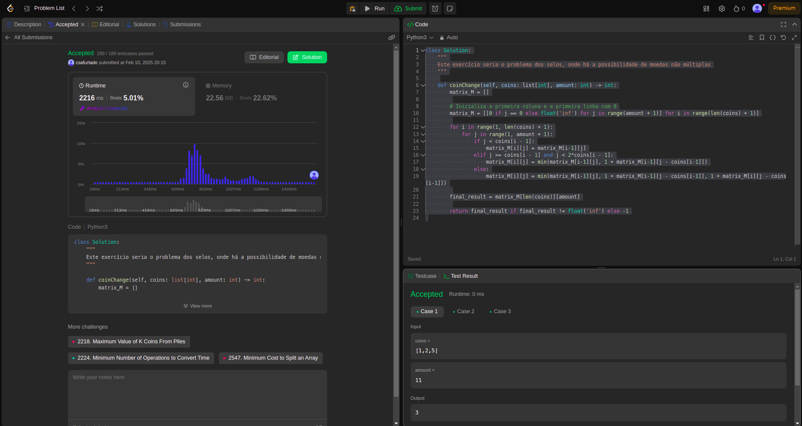
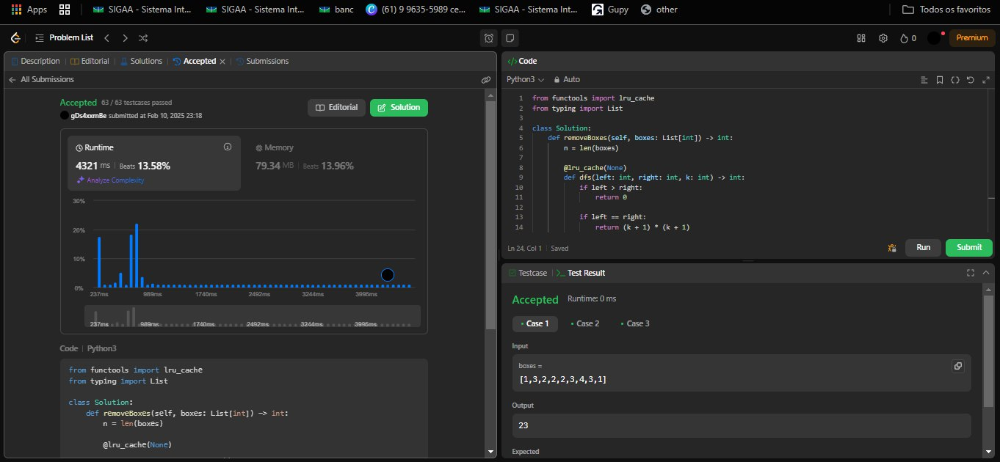

# Exercícios do Juiz Online LeetCode

**Número da Lista**: 49 
**Conteúdo da Disciplina**: Programação Dinâmica 

## Alunos
|Matrícula | Aluno |
| -- | -- |
| 17/0008291  |  Cristian Furtado |
| 21/1041043 |  Juan Pablo |

## Sobre 
Serão realizados 3 exercícios na plataforma no LeetCode que são:

- <a href="https://leetcode.com/problems/remove-boxes/description/">0546. Remover caixas (Difícil)</a>
- <a href="https://leetcode.com/problems/zuma-game/description/">0488. Jogo do Zuma (Difícil)</a>
- <a href="https://leetcode.com/problems/minimum-cost-for-tickets/description/">0983. Custo mínimo para tickets (Médio)</a>
- <a href="https://leetcode.com/problems/coin-change/">0322. Troco de moedas (Médio)</a>

## Screenshots

## Instalação 
**Linguagem**: Python 3.10.* 

Necessário ter instalado na máquina versão do Python 3.10.* para que sejam executados os exercícios e uma conta no site LeetCode.

## Uso 
Explique como usar seu projeto caso haja algum passo a passo após o comando de execução.

## Outros 
Quaisquer outras informações sobre seu projeto podem ser descritas abaixo.

## Links dos vídeos com explicação

[Exercício 0983](https://drive.google.com/file/d/1jG0H57ZWqm7o-TWjh1rlcY97oZD44JEE/view?usp=sharing)

[Exercício 0322](https://drive.google.com/file/d/1hV60t-13I-Wz2g27lfR2TdU0BFDzC-C8/view?usp=sharing)

[Exercício 0488](https://drive.google.com/file/d/1hV60t-13I-Wz2g27lfR2TdU0BFDzC-C8/view?usp=sharing)

[Exercício 0546](https://drive.google.com/file/d/1hV60t-13I-Wz2g27lfR2TdU0BFDzC-C8/view?usp=sharing)

